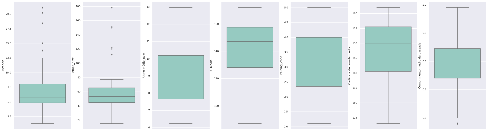

# Half-Marathon Training Exploratory Data Analysis (EDA)
* Search and aplly API connected to Garmin Connect using python.
* Examine the data for distribution, outliers and anomalies to direct the hypothesis formulation.
* Provide tools for hypothesis generation by visualizing and understanding the data through graphical representation.

## Introduction
Running is a great way to get fit, feel better and even form new relationships with other runners. Starting a new running habit doesn’t have to be hard — all it takes is a comfortable pair of shoes and a willingness to move a little or a lot, all at your own pace. However, the absolute best way to keep yourself running is to find a race, sign up for it, pay for it and put it on your calendar. A fixed race date will help you stay focused, and keep you on a regular running schedule. A beginner can run any race — you just need to allow enough time to train for it. Pick your distance and start a training plan. After the 5 km, the second-most popular race is the half-marathon (21.1 km). Half-marathons are great races for beginners because — like the marathon — you get the thrill of a big race event but you have to go only half the distance. Training for a half-marathon isn’t much different than training for a full one, though. You’ll need to be dedicated to your goal, but crossing that finish line will be you feel an indescribable emotion [1].

## Scope
Review the training plan for a half marathon.

## Method & Libraries
Colab (short for Collaboratory) is Google’s free platform which enables users to code in Python. It is a Jupyter Notebook-based cloud service, provided by Google [2]. Out of the most popular Python packages used in data science and machine learning , we find Pandas, Numpy, Matplotlib and Seaborn.

## Dataset
Garmin Connect is the tool for tracking, analyzing and sharing health and fitness activities from your Garmin device.The dataset used in this project is taken from my activity history tracked through my Garmin watch and logged into my Garmin Connect account.

## Data Import
Activities and wellness data files can be exported from Garmin Connect. Since devices have limited memory available for storage, this functionality allows customers access to historical activity data that can be used within other Garmin applications or supported third-party applications[3].

Activity exports offer multiple format options including:
* Export Original
* Export to TCX
* Export to GPX
* Export to Google Earth
* **Export Splits to CSV**

Some of Google Colab’s advantages include quick installation and real-time sharing of Notebooks between users. 
However, loading a CSV file requires writing some extra lines of codes [2]. 

## Data Cleaning
Data cleaning, also called data cleansing or scrubbing, deals with detecting and removing errors and inconsistencies from data in order to improve the quality of data. Data quality problems are present in single data collections, such as files and databases, e.g., due to misspellings during data entry, missing information or other invalid data [4].

### Cleaning Date data

### Cleanned data frame

## Exploratory Data Analysis
Exploratory data analysis (EDA) is an essential step in any research analysis. The primary aim with exploratory analysis is to examine the data for distribution, outliers and anomalies to direct specific testing of your hypothesis. It also provides tools for hypothesis generation by visualizing and understanding the data usually through graphical representation [5].

### Correlation plot

### Boxplot to check outliers

### Training Zone effect in Distance and Time

### Week distribution of Training  

## Conclusion

## References
1. Parker-Pope, Tara. How to Start Running, **The New York Times**. Available in: https://www.nytimes.com/guides/well/how-to-start-running
2. @09amit. Ways to import CSV files in Google Colab,**GeeksforGeeks**. Available in: https://www.geeksforgeeks.org/ways-to-import-csv-files-in-google-colab/
3. How Do I Export Data Out of Garmin Connect?, **Garmin Support Center**. Available in: https://support.garmin.com/en-US/?faq=W1TvTPW8JZ6LfJSfK512Q8  
4. Erhard Rahm, Hong Hai Do. Data Cleaning: Problems and Current Approaches, **Bulletin of the Technical Committee on Data Engineering**. University of Leipzig, Germany.
5. Komorowski, M., Marshall, D.C., Salciccioli, J.D., Crutain, Y. (2016). Exploratory Data Analysis. **Secondary Analysis of Electronic Health Records**. Springer, Cham. https://doi.org/10.1007/978-3-319-43742-2_15
